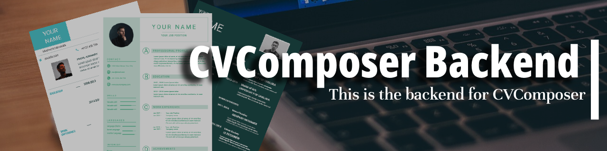

# CVComposer-backend

## Overview
CVComposer-backend is the backend of the CVComposer project. CVComposer is a web-based platform tailored to assist job seekers in crafting compelling CVs (Curriculum Vitae) and Cover Letters effortlessly. In the backend we also add a method of posting and and getting job postes from the database. The backend is built using Node.js, Express.js, and MongoDB.

## Features

### user authentication

#### Register User
* Endpoint: `http://localhost:8800/api/v1/auth/register`
  * Method: `POST``
  * Description: Register a new user.
  * Body: JSON containing username, email, and password.

#### Login
* Endpoint: `http://localhost:8800/api/v1/auth/login`
  * Method: `POST`
  * Description: Log in a user.
  * Body: JSON containing username and password.

#### Check Authentication
* Endpoint: `http://localhost:8800/api/v1/users/checkadmin/{userId}`
  * Method:`GET`
  * Description: Check if a user is an admin.
  * Params: userId (replace with actual user ID).

### User Management

#### Update User
* Endpoint: `http://localhost:8800/api/v1/users/{userId}`
  * Method: `PUT`
  * Description: Update user details, specifically set isAdmin to false.
  * Body: JSON containing isAdmin field.

### Job Management
#### Create Job
* Endpoint: `http://localhost:8800/api/v1/jobs`
  * Method: `POST`
  * Description: Create a new job posting.
  * Body: JSON with job details such as title, company, location, etc.

## contributors
