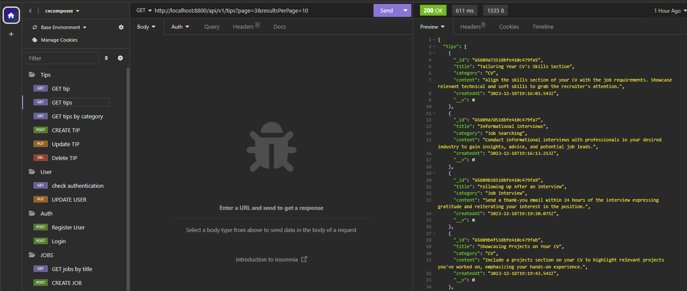
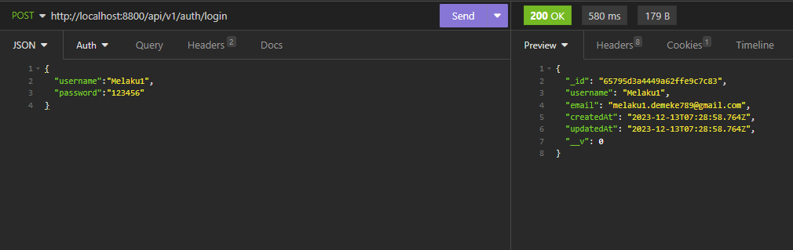
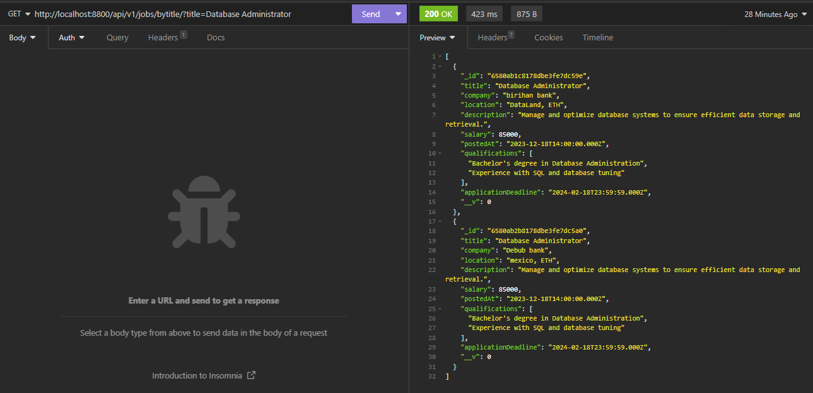

# CVComposer-backend


## Overview
CVComposer-backend is the backend of the CVComposer project. CVComposer is a web-based platform tailored to assist job seekers in crafting compelling CVs (Curriculum Vitae) and Cover Letters effortlessly. In the backend we also add a method of posting and and getting job postes from the database. The backend is built using Node.js, Express.js, and MongoDB.

<p align="left"> 
  
  
  
</p>

- [CVComposer-backend](#cvcomposer-backend)
  - [Overview](#overview)
  - [Features](#features)
    - [user authentication](#user-authentication)
      - [Register User](#register-user)
      - [Login](#login)
      - [Check Authentication](#check-authentication)
    - [User Management](#user-management)
      - [Update User](#update-user)
    - [Job Management](#job-management)
      - [Create Job](#create-job)
      - [Update Job](#update-job)
      - [Get Job](#get-job)
      - [Get All Jobs](#get-all-jobs)
      - [Get Job by Category](#get-job-by-category)
    - [Tips](#tips)
      - [Get All Tips](#get-all-tips)
      - [Get Tip by ID](#get-tip-by-id)
      - [Get Tips by Category](#get-tips-by-category)
      - [Create Tip](#create-tip)
  - [Usage](#usage)
  - [contributors](#contributors)

## Features

### user authentication

#### Register User
* Endpoint: `http://localhost:8800/api/v1/auth/register`
  * Method: `POST`
  * Description: Register a new user.
  * Body: JSON containing username, email, and password.

#### Login
* Endpoint: `http://localhost:8800/api/v1/auth/login`
  * Method: `POST`
  * Description: Log in a user.
  * Body: JSON containing username and password.

#### Check Authentication
* Endpoint: `http://localhost:8800/api/v1/users/checkadmin/{userId}`
  * Method:`GET`
  * Description: Check if a user is an admin.
  * Params: userId (replace with actual user ID).

### User Management

#### Update User
* Endpoint: `http://localhost:8800/api/v1/users/{userId}`
  * Method: `PUT`
  * Description: Update user details, specifically set isAdmin to false.
  * Body: JSON containing isAdmin field.

### Job Management

#### Create Job
* Endpoint: `http://localhost:8800/api/v1/jobs`
  * Method: `POST`
  * Description: Create a new job posting.
  * Body: JSON with job details such as title, company, location, etc.

#### Update Job
* Endpoint: `http://localhost:8800/api/v1/jobs/{JobId}`
  * Method: `PUT`
  * Description: Update an existing job posting.
  * Body: JSON with updated job details.

#### Get Job
* Endpoint: `http://localhost:8800/api/v1/jobs/{JobId}`
  * Method: `GET`
  * Description: Get details of a specific job.

#### Get All Jobs
* Endpoint: `http://localhost:8800/api/v1/jobs?page=1&resultsPerPage=10`
  * Method: `GET`
  * Description: Get a list of all jobs.
  * Features: implement pagination

#### Get Job by Category
* Endpoint: `GET /api/v1/tips/bytitle/?title={title}`
  * Description: Retrieve tips based on a specific category.
  * Headers: User-Agent: insomnia/8.4.5

### Tips

#### Get All Tips
* Endpoint: `GET /api/v1/tips?page=1&resultsPerPage=10`
  * Description: Retrieve all tips.
  * Headers: User-Agent: insomnia/8.4.5
  * Features: also implement pagination

#### Get Tip by ID
* Endpoint : `GET /api/v1/tips/find/{tipId}`
  * Description: Retrieve a specific tip by ID.
  * Headers: User-Agent: insomnia/8.4.5

#### Get Tips by Category
* Endpoint: `GET /api/v1/tips/bycategory/?category={category}`
  * Description: Retrieve tips based on a specific category.
  * Headers: User-Agent: insomnia/8.4.5

#### Create Tip
* Endpoint**: `POST /api/v1/tips`
  * Description: Create a new tip.
  * Headers: Content-Type: application/json, User-Agent: insomnia/8.4.5
  * Body:
  ```json
  {
      "title": "CV Writing Tips",
      "category": "CV",
      "content": "Highlight your key achievements, use action verbs, and keep your CV concise and well-organized. Tailor it for the specific job you're applying for."
  }

## Installation

To run the CVComposer-backend locally for development or testing purposes, follow these steps:

1. Clone the repository to your local machine:

   ```bash
   git clone https://github.com/MelakuDemeke/CVComposer-backend.git
   ```

2. Navigate to the project directory:

   ```bash
   cd CVComposer-backend
   ```

3. Install the required dependencies:

   ```bash
   npm install
   ```

4. Start the development server:

   ```bash
   npm run dev
   ```
5. Open your API tester and start expermenting the API

## Usage
Usage Guide for Experimenting with API Data in Insomnia

* Step 1: Navigate to the Test Folder
  * Open your project directory and locate the "Test" folder.

```bash
cd path/to/your/project/Test
```

* Step 2: Access the API Folder
  * Navigate into the "api" subfolder within the "Test" directory.

```bash
cd api
```

* Step 3: Retrieve the Backup JSON File
  * Find and copy the backup JSON file you want to use for testing. Ensure you have the file path for the next steps.

* Step 4: Open Insomnia API Tool
  * If you don't have Insomnia installed, download and install it from [Insomnia Website](https://insomnia.rest/download). Open Insomnia on your computer.

* Step 5: Import Data into Insomnia
  1. In Insomnia, click on the "Import/Export" option in the top-left corner.
  2. Select "Import Data".
  3. Choose the "From File" option.
  4. Navigate to the location where you saved the backup JSON file and select it.

* Step 6: Start Experimenting
Now that you've imported the data, you can start experimenting with your API requests.

  * Explore the imported requests in the sidebar.
  * Modify request parameters as needed.
  * Execute the requests to interact with your API.
Remember to save your changes in Insomnia as needed.

Happy experimenting! Here is Samples




## contributors
<a href="https://github.com/MelakuDemeke/CVComposer/graphs/contributors">
  
</a>
